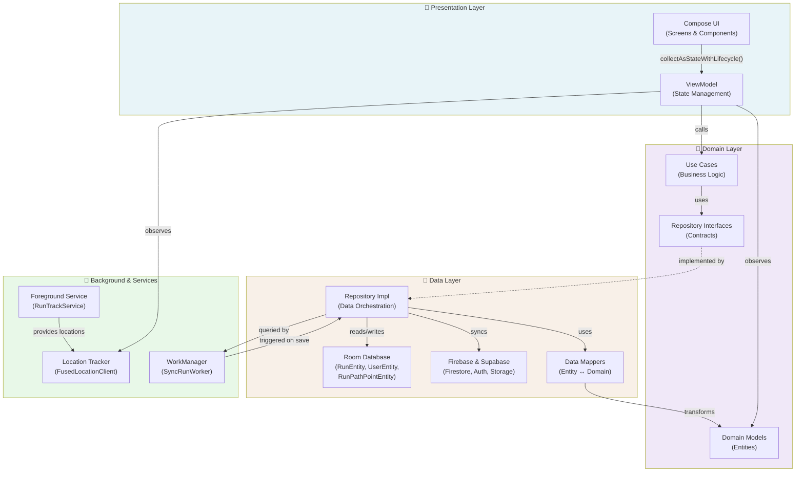

# 🏃‍♂️ Pace – Social GPS Running Tracker

[](https://kotlinlang.org)
[](https://www.android.com/versions/)
[](https://developer.android.com/jetpack/compose)
[](https://github.com/kuntalavi/Pace/releases)
[]()

> **Pace** is a minimalist, offline-first GPS running tracker designed for modern athletes. Track your runs with precision, share achievements socially, and analyze performance with beautiful visualizations—all powered by cutting-edge Android architecture.

---

## 📱 App Visuals

| Dashboard | Active Track | Social Feed |
|-----------|--------------|-------------|
|  |  |  |

---

## ✨ Core Features

- **🛰️ Real-Time GPS Tracking** – High-precision location capture via `FusedLocationProviderClient` with adaptive accuracy and battery optimization.

- **📍 Offline-First Architecture** – Runs are saved locally to Room Database first, then seamlessly synced to backend when connectivity is available. No data loss, guaranteed.

- **🗺️ Interactive Route Visualization** – View live running paths with polyline encoding, adaptive map rendering, and segment analysis on Google Maps.

- **📊 Comprehensive Analytics** – Track distance, pace, duration, elevation, speed variability, and heart rate zones with detailed breakdowns.

- **👥 Social Features** – Share runs with friends, view social feeds, follow athletes, and celebrate milestones together.

- **🏃 Foreground Service Tracking** – Robust background location service ensures accurate tracking even when the app is backgrounded or screen is off.

- **🔐 Secure Authentication** – Firebase Auth integration with Supabase backend for user data, cross-device sync, and privacy.

---

## 🎯 Architecture Overview

Pace implements **Clean Architecture** with **MVVM** presentation layer, ensuring scalability, testability, and separation of concerns:



### Data Flow: Tracking a Run

```
1. Start Run
   ↓
   ActiveRunViewModel → RunTrackService (Foreground) → LocationTracker (Flow-based GPS)
   ↓
2. Location Updates (Every 3 seconds)
   ↓
   FusedLocationProviderClient → LocationTrackerImpl → TrackerManager (StateFlow)
   ↓
3. Save Run
   ↓
   RunRepo.saveRun() → Room (RunEntity + RunPathPointEntity)
   ↓
4. Sync Trigger
   ↓
   WorkManager enqueues SyncRunWorker (with network constraints)
   ↓
5. Background Sync
   ↓
   SyncRunWorker reads unsynced runs → uploads to Firestore → marks synced=true
```

---

## 🛠️ Technology Stack

| Category | Technology |
|----------|-----------|
| **Language** | Kotlin 2.0+ |
| **UI Framework** | Jetpack Compose + Material Design 3 |
| **Architecture** | Clean Architecture + MVVM |
| **Dependency Injection** | Dagger Hilt 2.59+ |
| **Local Database** | Room 2.8+ |
| **Remote Backend** | Firebase (Auth, Firestore) + Supabase |
| **Navigation** | Compose Navigation (Type-Safe) |
| **Concurrency** | Kotlin Coroutines 1.10+ + Flow |
| **Background Work** | WorkManager 2.9+ |
| **Location Tracking** | Google Play Services - Location 21.1+ |
| **Maps** | Google Maps SDK 18.2+ |
| **Code Generation** | KSP 2.3+ |
| **Build System** | Gradle 8.5+ |
| **Minimum API** | 26 (Android 8.0+) |
| **Target API** | 36 (Android 15+) |

---

## 🏗️ Project Structure

```
com.rk.pace/
├── auth/                    # Authentication flows (SignIn, SignUp, Supabase integration)
├── domain/                  # Business logic layer
│   ├── model/              # Domain models (Run, User, RunPathPoint)
│   ├── repo/               # Repository interfaces
│   ├── use_case/           # Use case implementations
│   └── tracking/           # Tracking abstractions (LocationTracker, TimeTracker)
├── data/                    # Data layer
│   ├── room/               # Room database setup (entities, DAOs, v13 schema)
│   ├── repo/               # Repository implementations
│   ├── remote/             # Remote data sources (Firebase, Supabase)
│   ├── mapper/             # Data transformation (Entity ↔ Domain)
│   └── tracking/           # GPS & time tracking implementations
├── presentation/            # UI layer
│   ├── screens/            # Compose screens grouped by feature
│   ├── navigation/         # Type-safe Navigation routes
│   ├── components/         # Reusable Compose components
│   ├── charts/             # Chart visualization components
│   └── theme/              # Material 3 theme & styling
├── background/             # Background work
│   ├── SyncRunWorker       # WorkManager task for Firestore sync
│   └── RunTrackService     # Foreground location tracking service
├── di/                      # Hilt dependency injection modules
├── common/                  # Utilities, extensions, constants
└── theme/                   # Material Design 3 configuration
```

---

## 🚀 Quick Start

### Installation Methods

#### Option 1: Download & Install Pre-Built APK (Recommended for Users)

1. Visit the [Releases Page](https://github.com/kuntalavi/Pace/releases)
2. Download the latest **`pace-1.0.0-beta.apk`** from the Assets section
3. Transfer to your Android device or use `adb`:
   ```bash
   adb install pace-1.0.0-beta.apk
   ```
4. Open Pace and sign in with Google

#### Option 2: Clone & Build Locally (For Developers)

**Prerequisites:**
- Android Studio Iguana+ (2024.3+)
- Java Development Kit 21
- Android SDK with API 36
- Git

**Setup Instructions:**

1. **Clone the Repository**
   ```bash
   git clone https://github.com/kuntalavi/Pace.git
   cd Pace
   ```

2. **Configure API Keys** (`local.properties`)
   ```properties
   GOOGLE_MAPS_API_KEY=YOUR_GOOGLE_MAPS_API_KEY
   MAPBOX_ACCESS_TOKEN=YOUR_MAPBOX_TOKEN_OPTIONAL
   ```

3. **Firebase Setup**
   - Create a project in [Firebase Console](https://console.firebase.google.com/)
   - Enable Authentication (Google Sign-In) and Firestore
   - Download `google-services.json`
   - Place in `app/` directory

4. **Supabase Configuration** (Optional for Enhanced Features)
   - Create project at [Supabase](https://supabase.com)
   - Configure connection in code (see `FirebaseModule`)

5. **Build & Run**
   ```bash
   # Sync Gradle
   ./gradlew build
   
   # Install on device/emulator
   ./gradlew installDebug
   
   # Run tests
   ./gradlew test
   ```

---

## 📊 Database Schema

Pace uses Room with 5 core entities:

| Entity | Purpose | Key Fields |
|--------|---------|-----------|
| `UserEntity` | User profiles | userId, username, email, photoURI, followers, following |
| `RunEntity` | Run metadata | runId, userId, timestamp, durationMs, distanceMeters, avgSpeedMps, encodedPath, synced |
| `RunPathPointEntity` | GPS waypoints (1:N with RunEntity) | pointId, runId, latitude, longitude, speed, timestamp |
| `DeleteRunEntity` | Soft delete tracking | runId, userId (for sync reconciliation) |
| `WeekGoalsEntity` | Weekly targets | weekId, userId, targetDistanceMeters, completed |

**Relationships:**
- `UserEntity` ← 1:N → `RunEntity` (CASCADE delete)
- `RunEntity` ← 1:N → `RunPathPointEntity` (CASCADE delete)

---

## 🔄 Key Workflows

### Adding a New Screen

1. Define Route in `presentation/navigation/Route.kt` (sealed class)
2. Create ViewModel in `presentation/screens/{feature}/` with Hilt injection
3. Implement Composable screen with `@Composable` + `hiltViewModel()`
4. Register in `NavGraph.kt` with `composable()` builder
5. Navigate via lambda-based navigation callbacks

### Saving & Syncing a Run

1. Collect tracking data in `ActiveRunViewModel`
2. Call `RunRepo.saveRun(RunWithPath)` → saves to Room instantly
3. WorkManager automatically triggers `SyncRunWorker` with network constraints
4. Worker queries `RunDao.getUnsyncedRunsWithPath()`
5. Uploads to Firestore, marks `synced=1` on success
6. Failed syncs are retried on next connectivity

### Handling Offline Scenarios

- Runs saved to Room persist indefinitely
- On app restart → `RestoreUserRunsUseCase` pulls from Firestore (if online)
- Unsynced local runs take precedence
- GPS accuracy monitored via `TrackerManager.gpsStrength` (STRONG/MODERATE/WEAK)

---

## 🎨 Design Philosophy

- **Minimalist UI**: Clean, distraction-free interfaces focused on core data
- **Offline-First**: All critical features work without internet
- **Performance Optimized**: Polyline encoding reduces storage 95% vs raw coordinates
- **Material Design 3**: Modern theming with dynamic colors on Android 12+
- **Accessibility**: Full keyboard navigation, screen reader support

---

## 🗂️ Development Conventions

### ViewModel Pattern
```kotlin
// Use viewModelScope for lifecycle-aware coroutines
// Expose state as StateFlow (not MutableStateFlow to public)
// Collect with collectAsStateWithLifecycle() in Compose
```

### Composable Structure
```kotlin
@Composable
fun MyScreen(
    viewModel: MyViewModel = hiltViewModel(),
    onNavigate: (Route) -> Unit
) {
    val state by viewModel.state.collectAsStateWithLifecycle()
    Scaffold { /* ... */ }
}
```

### Repository Pattern
- Query Room for offline data first
- Fetch from remote if needed & online
- Map responses via `Mapper` to domain models
- Return `Flow<T>` for reactive updates

---

## 🧪 Testing

```bash
# Unit tests (JUnit 4)
./gradlew test

# Instrumented tests (Espresso)
./gradlew connectedAndroidTest
```

---

## 📈 Roadmap

- [ ] Wearable OS (Wear OS 4+) companion app
- [ ] Shoe mileage & gear analytics
- [ ] Route comparison & replay
- [ ] Weather integration for run logs
- [ ] Audio coaching (updates every km)
- [ ] GPX/TCX export functionality
- [ ] Advanced social: clubs, challenges, leaderboards

---

## 🤝 Contributing

Contributions are welcome! Follow these steps:

1. Fork the repository
2. Create a feature branch (`git checkout -b feature/amazing-feature`)
3. Commit changes (`git commit -m 'Add amazing feature'`)
4. Push to branch (`git push origin feature/amazing-feature`)
5. Open a Pull Request

Please refer to [AGENTS.md](./AGENTS.md) for detailed architectural guidelines and development patterns.

---

## 📄 License

This project is licensed under the **MIT License** – see [LICENSE]() file for details.

---

**Pace by [Ravi](https://github.com/kuntalavi)**  
*Track. Share. Run.*
